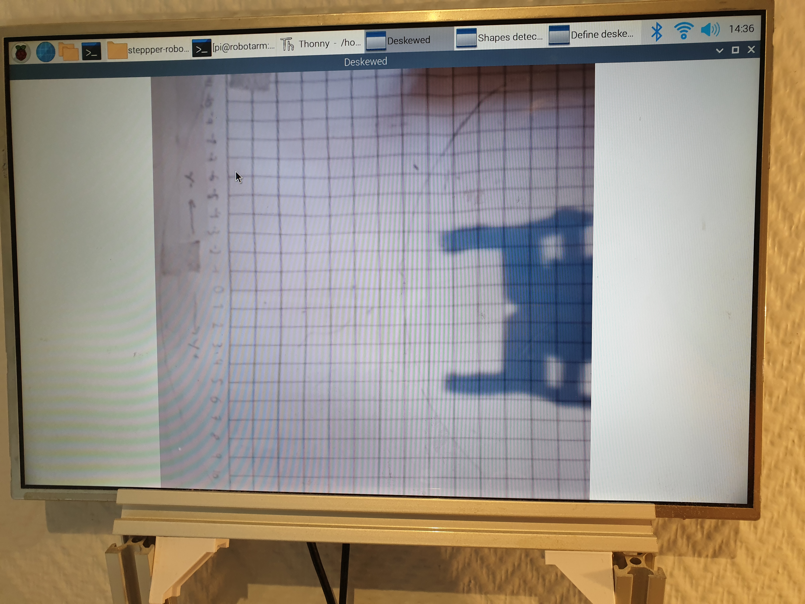

# robotCar - Still in progress
A six degreees of freedom (6DOF) robot arm able to pick up objects. Uses an Arduino Mega with a Ramps 1.4 shield to control 5 stepper motors, 2 servos and some switces. A Raspberry with a PiCam is used for the object detection.

## Design
Almost all parts of the arm are 3D-printed. 3D-printed ball bearings consisting of BB-bullets and and 3D-printed parts are used in stead of normal ball bearings.
Various sizes of NEMA17 stepper motors, a large servo and a 28-BYJ48  unipolar stepper motor are used to move the various joints. A small servo is used for the gripper. All joints using stepper motors have a limit switch used to detect the joint's home position. 
An arduino with a RAMPS 1.4 controls all of the motors and limit-switches. It communicates with a Raspberry Pi, responsible for object detection (using a Pi Cam).

## Forward and inward kinematics
Taken from https://github.com/glumb/robot-gui/blob/master/js/Kinematics.js
## Pick object detected by camera
The code uses cv2 as the framework to process images and detect objects. The objects width and orientation is not taken into account when picking it up (yet).

In software, the user can choose four points to define the area where the arm will look for objects to pick up. This area of the camera feed is deskewed in an effort to take into account the angle of the camera. By measuring the 2D-location if two in the image lies using the arm's coordinate system (center of arm is at (0,0)) and entering them into the code, all other points in the image can be converted (by scaling and shifting) into the corresponding coordinate in the arm's coordinate system.

A debug feature is implemented in the software to ensure that the pixels in the images from the camera feed are mapped to the correct coordinate in the arm's coordinate system. When selecting different points in the image, the arm will move to the mapped coordinate from the image, and if this matches the real world location (the arm's coordinate system) everything work's as intended.

## Pick and place ball

